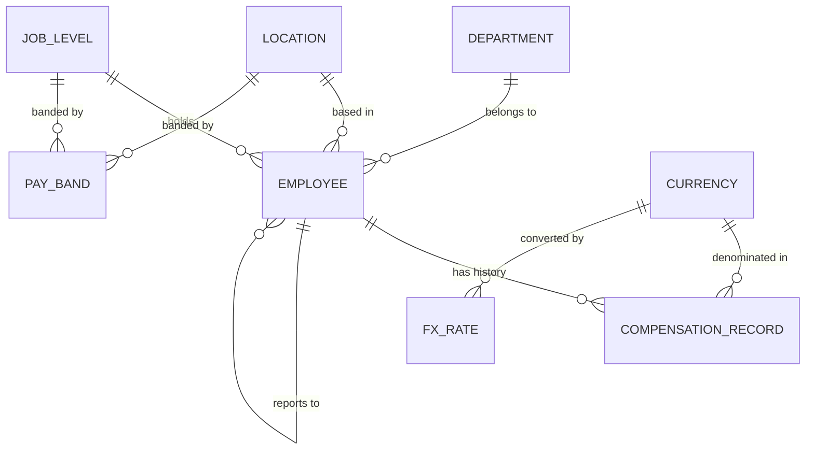

# Architecture

## Shape

    Next.js (App Router)  ──HTTP──>  NestJS API  ──>  PostgreSQL 16
           │                              │
           └──── packages/shared ─────────┘
                 (DTOs + Zod schemas)

Two deployables, one shared contract package. Request validation on the API and
form validation in the UI derive from the same Zod schemas, so a field cannot
drift between the two.

## Data model



### The central decision

An employee does **not** have a salary. An employee has a *history* of
compensation records, each valid from a date. Current pay is derived:

```sql
SELECT DISTINCT ON (employee_id) *
FROM compensation_record
WHERE effective_from <= CURRENT_DATE
ORDER BY employee_id, effective_from DESC;
```

This is the difference between software that replaces a spreadsheet and
software that *is* a spreadsheet with a nicer front end. It gives us, for free:
raise history, time-since-last-change, retroactive corrections, and future-dated
increases entered before they take effect.

### Key tables

**`employee`** — identity, department, location, job level, manager, hire date,
termination date. No pay figures.

**`compensation_record`** — `employee_id`, `effective_from`, `currency_code`,
`base_annual_minor`, `bonus_target_bps`, `allowance_annual_minor`,
`change_reason`, `created_by`, `created_at`. Append-only.

**`pay_band`** — `job_level_id` × `location_id` → min/mid/max in local currency.
Enables compa-ratio, the single most useful retention signal in comp management.

**`fx_rate`** — `currency_code` → rate against the reporting currency (USD).

**`audit_log`** — actor, entity, action, before/after JSON, timestamp.

### Money

Stored as `BIGINT` in **minor units** (cents, paise) alongside an explicit
currency code. Never floating point. `NUMERIC` was the alternative — it is
correct too, but Prisma surfaces it as a `Decimal` object that has to be
serialised at every API boundary. Integers cross the wire as integers. Formatting
happens once, in the UI, via `Intl.NumberFormat`.

`bonus_target_bps` is basis points, not a percentage — same reasoning, no floats.

## Query strategy

Prisma owns the schema, migrations, and CRUD. Analytics endpoints use hand-written
SQL, because the questions Priya asks are percentile questions:

```sql
percentile_cont(0.5) WITHIN GROUP (ORDER BY base_annual_minor)
```

No ORM query builder expresses that. The alternative is loading rows into Node
and computing medians in JavaScript, which works at 10,000 rows and falls over at
100,000. Aggregation belongs in the database. See ADR-003.

## Indexes

| Index | Serves |
|---|---|
| `compensation_record (employee_id, effective_from DESC)` | current-pay lookup, the hottest path |
| `employee (department_id)`, `(location_id)`, `(job_level_id)` | list filters |
| `employee (last_name, first_name)` | default sort |
| `pay_band (job_level_id, location_id)` UNIQUE | compa-ratio join |

## What production would additionally need

Called out so the omissions read as decisions rather than oversights: SSO and
role-based authorisation, OpenTelemetry traces and structured logs shipped to
CloudWatch, per-tenant data isolation, a read replica once analytics traffic
grows, and PII encryption at rest with field-level access controls on the
compensation table.

## Deployment (AWS)

- API: containerised, ECS Fargate behind an ALB
- Web: Next.js standalone build, same cluster or Amplify
- DB: RDS Postgres 16, private subnet, automated backups
- Config: SSM Parameter Store, no secrets in the image
